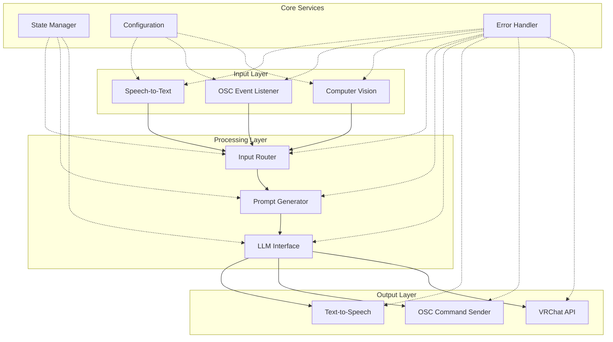
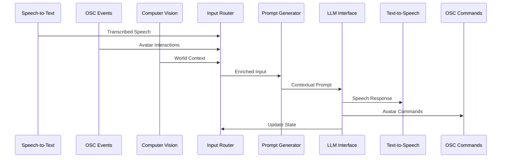

# VRChat AI Bot - Architecture Redesign Plan

## Current Architecture Analysis

### Current Limitations:
- **Monolithic Structure**: [`Main.py`](Main.py:1) contains 224 lines with mixed responsibilities
- **Global State Management**: Heavy use of global variables for conversation state, API clients, and timing
- **Tight Coupling**: Speech processing, LLM calls, OSC communication, and VRChat API all intertwined
- **Limited Error Handling**: Basic exception handling without recovery strategies
- **Hard-coded Configuration**: Device indices, model paths, and API endpoints scattered throughout code
- **No Modularity**: Difficult to test components independently or add new features

## Proposed Modular Architecture

## Module Specifications

### 1. Input Layer Modules
- **SpeechToTextModule**: Real-time audio processing with device abstraction
- **OSCEventListener**: OSC message parsing and event generation  
- **ComputerVisionModule**: World mapping and avatar interaction detection

### 2. Processing Layer Modules
- **InputRouter**: Route inputs to appropriate handlers with priority
- **PromptGenerator**: Context-aware prompt generation with OSC/CV data
- **LLMInterface**: Abstracted LLM communication with retry logic

### 3. Output Layer Modules
- **TextToSpeechModule**: TTS with voice selection and audio device management
- **OSCCommandSender**: Structured OSC message generation
- **VRChatAPIModule**: Friend management and API interactions

### 4. Core Services
- **StateManager**: Conversation state, world context, avatar state
- **ConfigurationManager**: Centralized config with environment support
- **ErrorHandler**: Comprehensive error handling and recovery

## Data Flow Diagram

## Key Architectural Improvements

### 1. Dependency Injection
- Remove global state
- Clear module boundaries
- Testable components

### 2. Event-Driven Architecture
- Asynchronous message passing
- Loose coupling between modules
- Scalable for new input/output types

### 3. Configuration Centralization
- Single source of truth for all settings
- Environment-specific configurations
- Runtime configuration updates

### 4. Error Resilience
- Graceful degradation
- Automatic recovery strategies
- Comprehensive logging

## Implementation Priority

**Phase 1**: Core modularization (Weeks 1-2)
- Extract existing functionality into modules
- Implement configuration system
- Add proper error handling

**Phase 2**: Enhanced features (Weeks 3-4)  
- OSC event system for avatar interactions
- Prompt generator integration
- Computer vision foundation

**Phase 3**: Advanced capabilities (Weeks 5-6)
- Full computer vision integration
- Advanced world mapping
- Performance optimization