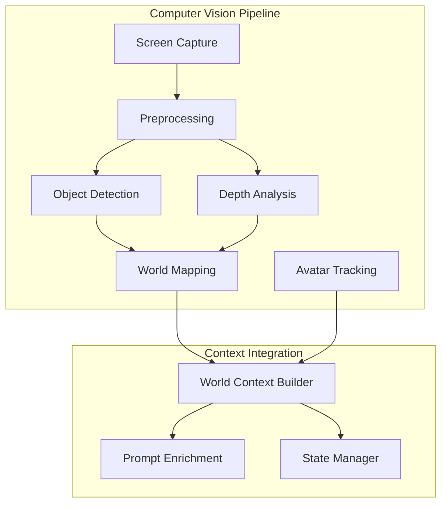

# Computer Vision & World Mapping Architecture

## Vision System Overview



## Computer Vision Components

### 1. Screen Capture Module
- **Purpose**: Capture VRChat game screen for analysis
- **Approaches**:
  - DirectX/OpenGL screen capture
  - Window-specific capture (VRChat window)
  - Performance-optimized frame sampling
- **Requirements**: 
  - Real-time capture (15-30 FPS)
  - Minimal performance impact
  - Window focus independence

### 2. Preprocessing Pipeline
- **Image Enhancement**: Contrast, brightness, sharpness
- **Noise Reduction**: Remove compression artifacts
- **Region of Interest**: Focus on relevant game areas
- **Frame Differencing**: Detect changes for efficiency

### 3. Object Detection System
- **Target Objects**:
  - Avatars (players)
  - Interactive objects
  - World boundaries
  - UI elements (minimap, chat)
- **Detection Methods**:
  - YOLO/SSD for real-time detection
  - Template matching for known UI elements
  - Color-based segmentation for world features

### 4. Depth Analysis
- **Purpose**: Create 3D understanding from 2D images
- **Techniques**:
  - Monocular depth estimation
  - Perspective analysis
  - Object size relationships
  - Motion parallax (if available)
- **Output**: Relative distance map of detected objects

### 5. World Mapping
- **Spatial Representation**:
  - Grid-based world map
  - Object positions and types
  - Navigable areas vs obstacles
  - Interactive element locations
- **Persistence**: Maintain map between sessions
- **Updates**: Real-time map refinement

### 6. Avatar Tracking
- **Player Identification**:
  - Avatar appearance tracking
  - Movement patterns
  - Proximity analysis
  - Interaction detection
- **Behavior Analysis**:
  - Gesture recognition
  - Movement intentions
  - Social grouping

## Depth Filter Implementation

### Technical Approach
```python
# Depth estimation pipeline
1. Frame capture → Preprocessing → Depth network → Post-processing
2. Object detection → Size/distance correlation → 3D positioning
3. Motion analysis → Parallax calculation → Depth refinement
```

### Depth Estimation Models
- **MiDaS**: Monocular depth estimation (lightweight)
- **DPT**: Dense Prediction Transformers (higher accuracy)
- **Custom training**: VRChat-specific depth patterns

### Performance Considerations
- **GPU vs CPU**: Prioritize real-time performance
- **Resolution scaling**: Balance accuracy vs speed
- **Frame skipping**: Process every 2nd/3rd frame if needed
- **Caching**: Reuse depth data for static scenes

## World Context Integration

### Context Data Structure
```python
@dataclass
class WorldContext:
    world_id: str
    map_data: WorldMap
    avatars: List[AvatarInfo]
    objects: List[WorldObject]
    interactive_elements: List[InteractiveElement]
    navigation_graph: NavigationGraph
    timestamp: float
```

### Prompt Enrichment
- **Location awareness**: "You're near the fountain in the center"
- **Avatar context**: "Three people are standing near you"
- **Object interaction**: "There's a chess board to your left"
- **Spatial reasoning**: "Move closer to hear better"

## OSC Integration for Enhanced Context

### Avatar State from OSC
- **Position data**: `/tracking/head` and `/tracking/controllers`
- **Gesture state**: `/avatar/parameters/GestureLeft`, `/avatar/parameters/GestureRight`
- **Expression data**: `/avatar/parameters/*` for facial expressions
- **Interaction events**: Touch, proximity, menu interactions

### Combining CV and OSC Data
- **Cross-validation**: Use OSC position to verify CV tracking
- **Enhanced accuracy**: OSC provides precise positions, CV provides environmental context
- **Redundancy**: Fallback when one system fails

## Implementation Strategy

### Phase 1: Foundation (Weeks 1-2)
- Basic screen capture and preprocessing
- Simple object detection (avatars, major objects)
- Depth estimation integration
- World map data structure

### Phase 2: Enhanced Detection (Weeks 3-4)
- Advanced object classification
- Avatar tracking and identification
- Interactive element detection
- Navigation graph generation

### Phase 3: Context Integration (Weeks 5-6)
- Prompt enrichment with world context
- OSC + CV data fusion
- Real-time context updates
- Performance optimization

## Technical Requirements

### Libraries & Dependencies
- **OpenCV**: Image processing and computer vision
- **PyTorch/TensorFlow**: Deep learning models
- **MSS/PyAutoGUI**: Screen capture
- **NumPy**: Numerical computations
- **Pillow**: Image manipulation

### Performance Targets
- **Frame rate**: 15-30 FPS processing
- **Latency**: <200ms end-to-end
- **CPU usage**: <30% on modern systems
- **Memory**: <2GB RAM usage

### Error Handling
- **Graceful degradation**: Continue with reduced functionality
- **Fallback modes**: Use OSC data when CV fails
- **Recovery**: Automatic restart of failed components
- **Logging**: Detailed performance and error tracking

## Future Enhancements

### Advanced Features
- **Semantic understanding**: Recognize room purposes (social, game, exploration)
- **Behavior prediction**: Anticipate player movements and interactions
- **Emotion recognition**: From avatar expressions and movements
- **Multi-world mapping**: Learn and adapt to different VRChat worlds

### Integration Opportunities
- **VRChat API**: Correlate with world and user data
- **Voice analysis**: Combine with speech patterns for richer context
- **Learning system**: Improve detection over time with user feedback