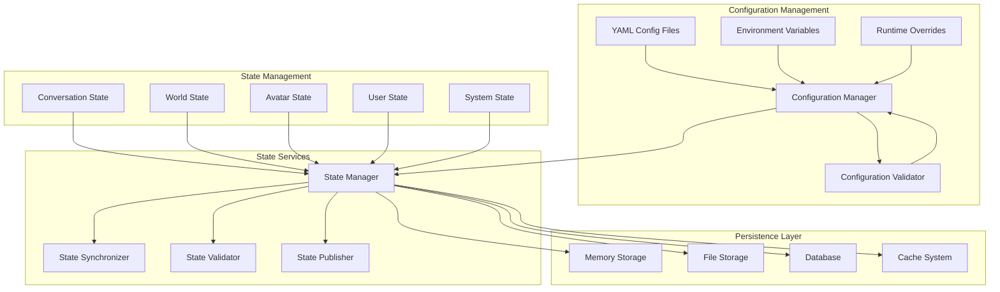

# Configuration & State Management Architecture

## System Overview



## Configuration System

### Configuration Hierarchy
```python
class ConfigurationManager:
    def __init__(self):
        self.config = {}
        self.sources = [
            "defaults.yaml",      # Built-in defaults
            "config.yaml",        # User configuration
            ".env",               # Environment variables
            "secrets.yaml",       # Sensitive data (encrypted)
            "runtime_overrides"   # Runtime changes
        ]
        
    def load_configuration(self) -> bool:
        """Load configuration from all sources in priority order"""
        for source in self.sources:
            self._load_source(source)
        return self.validate_configuration()
```

### Configuration Structure
```yaml
# config.yaml
bot:
  name: "Gerald"
  personality: "friendly, curious, helpful"
  speaking_style: "conversational"
  response_length: "medium"
  
audio:
  input_device: 2
  output_device: 20
  sample_rate: 16000
  voice_model: "Models/cori-high.onnx"
  volume: 1.0
  
osc:
  input_port: 9001
  output_port: 9000
  output_host: "127.0.0.1"
  enabled_events:
    - gestures
    - touch
    - expressions
    
llm:
  api_key: "${OPENROUTER_API_KEY}"
  model: "cognitivecomputations/dolphin-mistral-24b-venice-edition:free"
  max_tokens: 300
  temperature: 0.7
  
computer_vision:
  enabled: false
  capture_fps: 15
  processing_fps: 5
  depth_estimation: true
  object_detection: true
  
vrchat:
  api_enabled: false
  username: "BotToeRees"
  auto_friend_accept: true
  
logging:
  level: "INFO"
  file: "logs/bot.log"
  max_size: "10MB"
  backup_count: 5
  
performance:
  max_concurrent_requests: 3
  cache_ttl: 300
  cleanup_interval: 60
```

### Environment Configuration
```python
# Environment-specific configs
CONFIG_PROFILES = {
    "development": {
        "logging": {"level": "DEBUG"},
        "performance": {"cache_ttl": 60},
        "computer_vision": {"enabled": True}
    },
    "production": {
        "logging": {"level": "WARNING"},
        "performance": {"cache_ttl": 300},
        "computer_vision": {"enabled": False}
    },
    "testing": {
        "logging": {"level": "INFO"},
        "performance": {"cache_ttl": 0},
        "llm": {"mock_responses": True}
    }
}
```

## State Management System

### State Data Structures
```python
@dataclass
class ConversationState:
    messages: List[Message]
    current_topic: str
    emotional_tone: str
    speaking_style: str
    user_preferences: Dict[str, Any]
    conversation_goals: List[str]
    last_interaction_time: float
    conversation_duration: float

@dataclass
class WorldState:
    world_id: str
    world_name: str
    player_count: int
    avatars: Dict[str, AvatarInfo]
    objects: Dict[str, WorldObject]
    interactive_elements: Dict[str, InteractiveElement]
    navigation_graph: NavigationGraph
    last_updated: float

@dataclass
class AvatarState:
    position: Vector3
    rotation: Quaternion
    gestures: Dict[str, float]
    expressions: Dict[str, float]
    touch_sensors: Dict[str, bool]
    proximity_data: Dict[str, float]
    movement_state: MovementState
    last_interaction: Interaction

@dataclass
class UserState:
    user_id: str
    display_name: str
    relationship_level: float
    interaction_history: List[Interaction]
    preferences: Dict[str, Any]
    conversation_patterns: List[Pattern]
    emotional_baseline: EmotionalState

@dataclass
class SystemState:
    performance_metrics: PerformanceMetrics
    error_count: int
    last_error: Optional[Error]
    resource_usage: ResourceUsage
    uptime: float
    active_modules: List[str]
```

### State Manager Implementation
```python
class StateManager:
    def __init__(self, config: ConfigurationManager):
        self.config = config
        self.states = {
            "conversation": ConversationState(),
            "world": WorldState(),
            "avatar": AvatarState(),
            "users": {},  # user_id -> UserState
            "system": SystemState()
        }
        self.persistence = StatePersistence(config)
        self.observers = []
        
    def update_state(self, state_type: str, updates: Dict[str, Any]) -> bool:
        """Update specific state with new data"""
        current_state = self.states[state_type]
        updated_state = self._apply_updates(current_state, updates)
        
        if self._validate_state(updated_state):
            self.states[state_type] = updated_state
            self._notify_observers(state_type, updated_state)
            self.persistence.save_state(state_type, updated_state)
            return True
        return False
        
    def get_state(self, state_type: str, user_id: str = None) -> Any:
        """Get current state, optionally for specific user"""
        if user_id and state_type == "users":
            return self.states["users"].get(user_id)
        return self.states[state_type]
```

## Persistence Layer

### Storage Backends
```python
class StatePersistence:
    def __init__(self, config: ConfigurationManager):
        self.config = config
        self.backends = {
            "memory": MemoryStorage(),
            "file": FileStorage(config.get("storage.file_path")),
            "database": DatabaseStorage(config.get("storage.database_url"))
        }
        
    def save_state(self, state_type: str, state: Any) -> bool:
        """Save state to appropriate storage backend"""
        backend = self._select_backend(state_type)
        return backend.save(f"state_{state_type}", state)
        
    def load_state(self, state_type: str) -> Any:
        """Load state from storage"""
        backend = self._select_backend(state_type)
        return backend.load(f"state_{state_type}")
        
    def _select_backend(self, state_type: str) -> StorageBackend:
        """Select appropriate storage backend based on state type"""
        if state_type in ["conversation", "avatar"]:
            return self.backends["memory"]  # Frequent updates
        elif state_type in ["world", "users"]:
            return self.backends["file"]    # Moderate updates
        else:
            return self.backends["database"] # Rare updates
```

### Memory Storage
```python
class MemoryStorage:
    def __init__(self):
        self.data = {}
        self.ttl_config = {
            "conversation": 3600,  # 1 hour
            "avatar": 300,         # 5 minutes
            "system": 1800         # 30 minutes
        }
        
    def save(self, key: str, value: Any) -> bool:
        self.data[key] = {
            "value": value,
            "timestamp": time.time(),
            "ttl": self.ttl_config.get(key.split('_')[1], 300)
        }
        return True
        
    def load(self, key: str) -> Any:
        if key in self.data:
            entry = self.data[key]
            if time.time() - entry["timestamp"] < entry["ttl"]:
                return entry["value"]
            else:
                del self.data[key]  # Expired
        return None
```

## State Synchronization

### Multi-Module Synchronization
```python
class StateSynchronizer:
    def __init__(self, state_manager: StateManager):
        self.state_manager = state_manager
        self.locks = {}
        
    def atomic_update(self, state_type: str, update_fn: Callable) -> Any:
        """Perform atomic state update with lock"""
        with self._get_lock(state_type):
            current_state = self.state_manager.get_state(state_type)
            new_state = update_fn(current_state)
            self.state_manager.update_state(state_type, new_state)
            return new_state
            
    def sync_across_modules(self, state_type: str, updates: Dict) -> bool:
        """Synchronize state across all interested modules"""
        # Notify all modules about state change
        for module in self._get_interested_modules(state_type):
            module.on_state_change(state_type, updates)
        return True
```

## Configuration Validation

### Schema Validation
```python
class ConfigurationValidator:
    def __init__(self):
        self.schemas = self._load_schemas()
        
    def validate_configuration(self, config: Dict) -> ValidationResult:
        """Validate entire configuration against schemas"""
        errors = []
        
        for section, schema in self.schemas.items():
            if section in config:
                section_errors = self._validate_section(config[section], schema)
                errors.extend(section_errors)
                
        return ValidationResult(errors=errors, valid=len(errors) == 0)
        
    def _validate_section(self, section_config: Dict, schema: Dict) -> List[str]:
        """Validate a configuration section"""
        errors = []
        for key, value_schema in schema.items():
            if key in section_config:
                if not self._validate_value(section_config[key], value_schema):
                    errors.append(f"Invalid value for {key}: {section_config[key]}")
            elif value_schema.get("required", False):
                errors.append(f"Missing required configuration: {key}")
        return errors
```

## Runtime Configuration Updates

### Hot-Reload System
```python
class HotReloadManager:
    def __init__(self, config_manager: ConfigurationManager):
        self.config_manager = config_manager
        self.watcher = FileSystemWatcher()
        self.callbacks = {}
        
    def start_watching(self) -> bool:
        """Start watching configuration files for changes"""
        self.watcher.watch("config.yaml", self._on_config_change)
        self.watcher.watch("secrets.yaml", self._on_secrets_change)
        return True
        
    def _on_config_change(self, file_path: str) -> None:
        """Handle configuration file changes"""
        new_config = self.config_manager.load_file(file_path)
        if self.config_manager.validate_configuration(new_config):
            old_config = self.config_manager.config
            self.config_manager.config = new_config
            self._notify_changes(old_config, new_config)
```

## Implementation Strategy

### Phase 1: Basic Configuration (Week 1)
- Implement YAML configuration loading
- Create configuration validation
- Add environment variable support
- Implement basic state management

### Phase 2: Advanced State (Week 2)
- Add state persistence layer
- Implement state synchronization
- Create user state management
- Add performance monitoring

### Phase 3: Production Features (Week 3)
- Implement configuration hot-reload
- Add encryption for sensitive data
- Create backup and recovery system
- Add comprehensive logging

## Error Handling

### Configuration Errors
```python
class ConfigurationError(Exception):
    pass

class ValidationError(ConfigurationError):
    pass

class LoadError(ConfigurationError):
    pass

class StateError(Exception):
    pass

class PersistenceError(StateError):
    pass

class SynchronizationError(StateError):
    pass
```

### Recovery Strategies
- **Configuration errors**: Fallback to defaults, log detailed errors
- **State corruption**: Restore from backup, reset to initial state
- **Persistence failures**: Continue with memory-only mode
- **Synchronization issues**: Queue updates, retry later

This configuration and state management system will provide a robust foundation for your VRChat AI bot, ensuring reliable operation and easy customization.