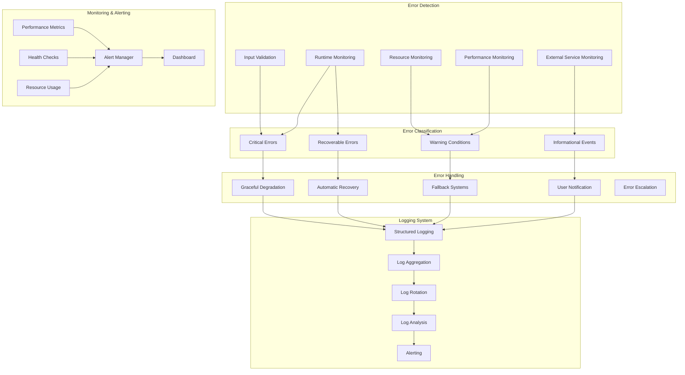

# Error Handling & Logging Strategy

## System Overview



## Error Classification System

### Error Severity Levels
```python
class ErrorSeverity(Enum):
    CRITICAL = 5    # System cannot function
    ERROR = 4       # Major functionality broken
    WARNING = 3     # Minor issues, system functional
    INFO = 2        # Normal operational messages
    DEBUG = 1       # Detailed debugging information
```

### Error Categories
```python
@dataclass
class ErrorCategory:
    name: str
    severity: ErrorSeverity
    recovery_strategy: str
    auto_recoverable: bool
    
ERROR_CATEGORIES = {
    "AUDIO_DEVICE_ERROR": ErrorCategory(
        name="Audio Device Error",
        severity=ErrorSeverity.ERROR,
        recovery_strategy="device_fallback",
        auto_recoverable=True
    ),
    "OSC_CONNECTION_ERROR": ErrorCategory(
        name="OSC Connection Error", 
        severity=ErrorSeverity.ERROR,
        recovery_strategy="reconnect_retry",
        auto_recoverable=True
    ),
    "LLM_API_ERROR": ErrorCategory(
        name="LLM API Error",
        severity=ErrorSeverity.WARNING,
        recovery_strategy="cache_fallback",
        auto_recoverable=True
    ),
    "COMPUTER_VISION_ERROR": ErrorCategory(
        name="Computer Vision Error",
        severity=ErrorSeverity.WARNING,
        recovery_strategy="disable_feature",
        auto_recoverable=True
    ),
    "CONFIGURATION_ERROR": ErrorCategory(
        name="Configuration Error",
        severity=ErrorSeverity.CRITICAL,
        recovery_strategy="default_fallback",
        auto_recoverable=False
    )
}
```

## Error Handling Framework

### Centralized Error Handler
```python
class ErrorHandler:
    def __init__(self, config: ConfigurationManager, state_manager: StateManager):
        self.config = config
        self.state_manager = state_manager
        self.logger = StructuredLogger()
        self.recovery_strategies = self._init_recovery_strategies()
        
    def handle_error(self, error: Exception, context: Dict[str, Any]) -> ErrorResponse:
        """Main error handling entry point"""
        error_info = self._classify_error(error, context)
        
        # Log the error
        self.logger.log_error(error_info)
        
        # Update system state
        self.state_manager.update_system_error_state(error_info)
        
        # Execute recovery strategy
        recovery_result = self._execute_recovery_strategy(error_info)
        
        # Notify if necessary
        if error_info.severity >= ErrorSeverity.ERROR:
            self._notify_concerned_modules(error_info)
            
        return ErrorResponse(
            handled=True,
            recovery_successful=recovery_result.success,
            fallback_activated=recovery_result.fallback_used,
            user_message=recovery_result.user_message
        )
```

### Recovery Strategies
```python
class RecoveryStrategies:
    def device_fallback(self, error_info: ErrorInfo) -> RecoveryResult:
        """Fallback to alternative audio devices"""
        available_devices = self._get_available_devices()
        current_device = error_info.context.get("device_id")
        
        for device in available_devices:
            if device != current_device and self._test_device(device):
                self.config.set("audio.input_device", device.id)
                return RecoveryResult(
                    success=True,
                    fallback_used=True,
                    message=f"Switched to device: {device.name}"
                )
                
        return RecoveryResult(
            success=False,
            fallback_used=False,
            message="No alternative devices available"
        )
        
    def reconnect_retry(self, error_info: ErrorInfo) -> RecoveryResult:
        """Retry connection with exponential backoff"""
        max_retries = 3
        base_delay = 1.0
        
        for attempt in range(max_retries):
            try:
                if self._reconnect_service():
                    return RecoveryResult(
                        success=True,
                        fallback_used=False,
                        message=f"Reconnected after {attempt + 1} attempts"
                    )
            except Exception as e:
                delay = base_delay * (2 ** attempt)
                time.sleep(delay)
                
        return RecoveryResult(
            success=False,
            fallback_used=True,
            message="Failed to reconnect after multiple attempts"
        )
        
    def cache_fallback(self, error_info: ErrorInfo) -> RecoveryResult:
        """Use cached responses when LLM fails"""
        cached_response = self._get_cached_response(error_info.context)
        if cached_response:
            return RecoveryResult(
                success=True,
                fallback_used=True,
                message="Using cached response",
                data=cached_response
            )
            
        return RecoveryResult(
            success=False,
            fallback_used=False,
            message="No cached response available"
        )
```

## Logging System

### Structured Logging
```python
@dataclass
class LogEntry:
    timestamp: str
    level: str
    module: str
    message: str
    error_code: Optional[str]
    context: Dict[str, Any]
    session_id: str
    user_id: Optional[str]
    performance_data: Optional[Dict]
    
class StructuredLogger:
    def __init__(self, config: ConfigurationManager):
        self.config = config
        self.session_id = str(uuid.uuid4())
        
    def log_error(self, error_info: ErrorInfo) -> None:
        entry = LogEntry(
            timestamp=datetime.now().isoformat(),
            level=error_info.severity.name,
            module=error_info.module,
            message=error_info.message,
            error_code=error_info.error_code,
            context=error_info.context,
            session_id=self.session_id,
            user_id=error_info.context.get("user_id"),
            performance_data=error_info.performance_data
        )
        self._write_log(entry)
        
    def log_performance(self, module: str, operation: str, duration: float) -> None:
        entry = LogEntry(
            timestamp=datetime.now().isoformat(),
            level="INFO",
            module=module,
            message=f"Performance: {operation}",
            error_code=None,
            context={"operation": operation, "duration": duration},
            session_id=self.session_id,
            user_id=None,
            performance_data={"duration": duration, "operation": operation}
        )
        self._write_log(entry)
```

### Log Configuration
```yaml
logging:
  level: "INFO"
  format: "json"
  output:
    - file: "logs/bot.log"
      max_size: "10MB"
      backup_count: 5
    - console: true
  rotation:
    enabled: true
    max_size: "10MB"
    backup_count: 5
    compression: true
  performance:
    enabled: true
    threshold_ms: 1000
  errors:
    detailed_context: true
    include_stack_trace: true
```

## Monitoring & Alerting

### Health Monitoring
```python
class HealthMonitor:
    def __init__(self, config: ConfigurationManager):
        self.config = config
        self.checks = [
            AudioHealthCheck(),
            OSCHealthCheck(),
            LLMHealthCheck(),
            MemoryHealthCheck(),
            PerformanceHealthCheck()
        ]
        
    def run_health_checks(self) -> HealthReport:
        """Run all health checks and generate report"""
        results = []
        overall_health = HealthStatus.HEALTHY
        
        for check in self.checks:
            result = check.execute()
            results.append(result)
            if result.status == HealthStatus.UNHEALTHY:
                overall_health = HealthStatus.UNHEALTHY
            elif result.status == HealthStatus.DEGRADED and overall_health == HealthStatus.HEALTHY:
                overall_health = HealthStatus.DEGRADED
                
        return HealthReport(
            overall_health=overall_health,
            checks=results,
            timestamp=datetime.now()
        )
```

### Performance Monitoring
```python
class PerformanceMonitor:
    def __init__(self, config: ConfigurationManager):
        self.config = config
        self.metrics = {
            "response_time": Gauge("response_time_seconds", "LLM response time"),
            "audio_latency": Gauge("audio_latency_ms", "Audio processing latency"),
            "memory_usage": Gauge("memory_usage_bytes", "Memory usage"),
            "error_rate": Counter("error_count", "Error count by type")
        }
        
    def track_operation(self, operation: str, func: Callable) -> Any:
        """Decorator to track operation performance"""
        start_time = time.time()
        try:
            result = func()
            duration = time.time() - start_time
            self.metrics["response_time"].set(duration)
            return result
        except Exception as e:
            self.metrics["error_rate"].inc()
            raise
```

## Alerting System

### Alert Configuration
```yaml
alerts:
  critical_errors:
    enabled: true
    threshold: 1
    cooldown: 300
    channels: ["console", "log_file"]
    
  performance_degradation:
    enabled: true 
    threshold_ms: 2000
    window: "5m"
    channels: ["console"]
    
  resource_usage:
    enabled: true
    memory_threshold: "80%"
    cpu_threshold: "90%"
    channels: ["console", "log_file"]
    
  external_service_failure:
    enabled: true
    consecutive_failures: 3
    channels: ["console", "log_file"]
```

### Alert Manager
```python
class AlertManager:
    def __init__(self, config: ConfigurationManager):
        self.config = config
        self.alert_channels = self._init_channels()
        self.alert_history = []
        
    def send_alert(self, alert: Alert) -> bool:
        """Send alert through configured channels"""
        if self._should_throttle(alert):
            return False
            
        sent = False
        for channel_name in alert.channels:
            channel = self.alert_channels.get(channel_name)
            if channel:
                channel.send(alert)
                sent = True
                
        if sent:
            self.alert_history.append(alert)
            
        return sent
        
    def _should_throttle(self, alert: Alert) -> bool:
        """Prevent alert spam with cooldown periods"""
        recent_alerts = [
            a for a in self.alert_history
            if a.type == alert.type and 
            (datetime.now() - a.timestamp).seconds < alert.cooldown
        ]
        return len(recent_alerts) > 0
```

## Implementation Strategy

### Phase 1: Basic Error Handling (Week 1)
- Implement core error classification system
- Create basic logging infrastructure
- Add input validation to all modules
- Implement graceful degradation for critical failures

### Phase 2: Advanced Recovery (Week 2)
- Implement automatic recovery strategies
- Add performance monitoring
- Create health check system
- Add resource usage monitoring

### Phase 3: Production Monitoring (Week 3)
- Implement structured logging with rotation
- Add alerting system
- Create dashboard for monitoring
- Add comprehensive testing for error scenarios

### Phase 4: Optimization (Week 4)
- Performance optimization of error handling
- Fine-tune alert thresholds
- Add predictive error detection
- Implement automated recovery testing

## Error Scenarios & Responses

### Common Error Scenarios

1. **Audio Device Failure**
   - Detection: Audio input/output errors
   - Recovery: Switch to alternative devices
   - Fallback: Text-only mode

2. **OSC Connection Lost**
   - Detection: No OSC messages received
   - Recovery: Automatic reconnection with backoff
   - Fallback: Continue without avatar interactions

3. **LLM API Failure**
   - Detection: API timeouts or errors
   - Recovery: Retry with exponential backoff
   - Fallback: Use cached responses or simple patterns

4. **Computer Vision Crash**
   - Detection: CV process termination
   - Recovery: Restart CV subsystem
   - Fallback: Disable CV features temporarily

5. **Memory Exhaustion**
   - Detection: High memory usage
   - Recovery: Clear caches and restart modules
   - Fallback: Reduce functionality to essential features

## Testing Strategy

### Error Injection Testing
```python
class ErrorInjectionTests:
    def test_audio_device_failure(self):
        """Test recovery from audio device failure"""
        with self.inject_error("audio_device_unavailable"):
            response = self.bot.process_input("test message")
            self.assertTrue(response.fallback_used)
            self.assertEqual(response.mode, "text_only")
            
    def test_llm_api_timeout(self):
        """Test recovery from LLM API timeout"""
        with self.inject_error("llm_timeout"):
            response = self.bot.process_input("test message")
            self.assertTrue(response.cached_response_used)
            self.assertIsNotNone(response.message)
```

This comprehensive error handling and logging strategy will ensure your VRChat AI bot remains stable and recoverable even when facing various failure scenarios, providing a robust user experience.