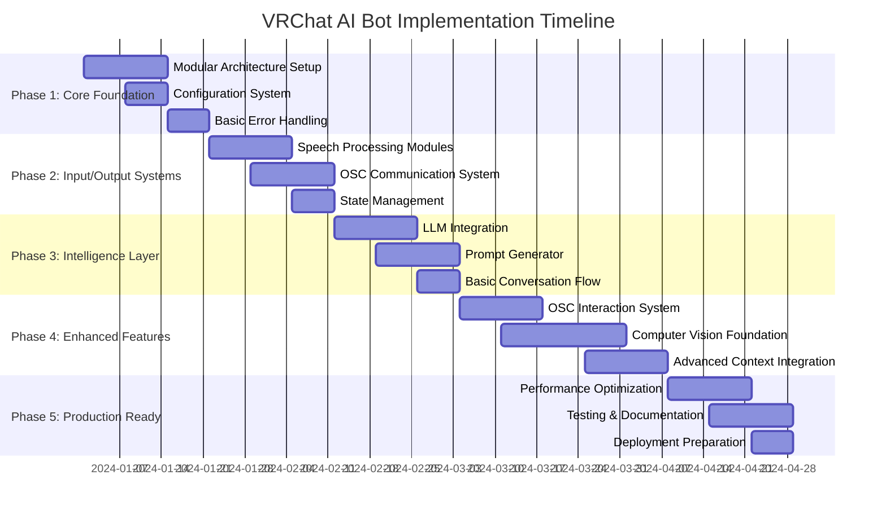

# VRChat AI Bot - Implementation Roadmap

## Project Overview

This roadmap outlines the step-by-step implementation of the modular VRChat AI bot architecture, prioritizing core functionality while building toward advanced features.

## Phase 1: Core Foundation (Weeks 1-2)

### Week 1: Project Structure & Configuration
- **Objective**: Set up modular project structure and configuration system
- **Deliverables**:
  - New project directory structure
  - Configuration manager with YAML support
  - Environment variable integration
  - Basic logging system
- **Files to Create**:
  - `src/core/configuration_manager.py`
  - `src/core/error_handler.py`
  - `src/core/logger.py`
  - `config/defaults.yaml`
  - `config/development.yaml`

### Week 2: Core Services
- **Objective**: Implement core state management and error handling
- **Deliverables**:
  - State manager with conversation state
  - Comprehensive error classification
  - Basic recovery strategies
  - Health monitoring system
- **Files to Create**:
  - `src/core/state_manager.py`
  - `src/core/health_monitor.py`
  - `src/models/state_models.py`
  - `src/utils/validators.py`

## Phase 2: Input/Output Systems (Weeks 3-4)

### Week 3: Speech Processing
- **Objective**: Modularize speech-to-text and text-to-speech
- **Deliverables**:
  - SpeechToText module with device management
  - TextToSpeech module with voice selection
  - Audio device discovery and configuration
  - Real-time audio processing pipeline
- **Files to Create**:
  - `src/modules/speech_to_text.py`
  - `src/modules/text_to_speech.py`
  - `src/utils/audio_utils.py`
  - `src/models/audio_models.py`

### Week 4: OSC Communication
- **Objective**: Implement OSC input/output systems
- **Deliverables**:
  - OSC event listener for VRChat messages
  - OSC command sender for bot actions
  - Basic chat message handling
  - Avatar parameter monitoring
- **Files to Create**:
  - `src/modules/osc_event_listener.py`
  - `src/modules/osc_command_sender.py`
  - `src/models/osc_models.py`
  - `src/utils/osc_utils.py`

## Phase 3: Intelligence Layer (Weeks 5-6)

### Week 5: LLM Integration
- **Objective**: Create robust LLM communication system
- **Deliverables**:
  - LLM interface with multiple provider support
  - Response caching and retry logic
  - Token usage tracking
  - Model selection system
- **Files to Create**:
  - `src/modules/llm_interface.py`
  - `src/utils/llm_utils.py`
  - `src/models/llm_models.py`
  - `src/core/cache_manager.py`

### Week 6: Prompt Generation & Conversation
- **Objective**: Implement context-aware prompt generation
- **Deliverables**:
  - Template-based prompt generator
  - Conversation state integration
  - Basic context aggregation
  - Response validation system
- **Files to Create**:
  - `src/modules/prompt_generator.py`
  - `src/templates/conversation.yaml`
  - `src/templates/action.yaml`
  - `src/utils/template_utils.py`

## Phase 4: Enhanced Features (Weeks 7-9)

### Week 7: OSC Interaction System
- **Objective**: Add advanced avatar interaction capabilities
- **Deliverables**:
  - Gesture pattern recognition
  - Touch and proximity event handling
  - Automatic response system for interactions
  - Interaction history tracking
- **Files to Create**:
  - `src/modules/interaction_detector.py`
  - `src/models/interaction_models.py`
  - `src/utils/pattern_matcher.py`
  - `config/interaction_patterns.yaml`

### Week 8-9: Computer Vision Foundation
- **Objective**: Implement basic computer vision capabilities
- **Deliverables**:
  - Screen capture system
  - Basic object detection
  - Depth estimation integration
  - World mapping data structures
- **Files to Create**:
  - `src/modules/computer_vision.py`
  - `src/modules/screen_capture.py`
  - `src/models/vision_models.py`
  - `src/utils/vision_utils.py`

## Phase 5: Production Ready (Weeks 10-12)

### Week 10-11: Performance & Optimization
- **Objective**: Optimize system performance and reliability
- **Deliverables**:
  - Performance monitoring and metrics
  - Memory usage optimization
  - Response time improvements
  - Resource management
- **Files to Create**:
  - `src/core/performance_monitor.py`
  - `src/utils/optimization.py`
  - `scripts/performance_test.py`
  - `docs/performance_guide.md`

### Week 12: Testing & Documentation
- **Objective**: Comprehensive testing and user documentation
- **Deliverables**:
  - Unit tests for all modules
  - Integration testing suite
  - User configuration guide
  - Troubleshooting documentation
- **Files to Create**:
  - `tests/unit/` (test files for each module)
  - `tests/integration/`
  - `docs/user_guide.md`
  - `docs/troubleshooting.md`

## Critical Path Dependencies

### Must-Have Dependencies (Blocking)
1. **Configuration System** → All other modules
2. **State Management** → Conversation flow, Prompt generation
3. **Error Handling** → Production reliability
4. **Speech Processing** → Core user interaction
5. **LLM Integration** → Intelligent responses

### Nice-to-Have Dependencies (Parallel)
1. **Computer Vision** → Can be developed independently
2. **Advanced OSC Interactions** → Builds on basic OSC
3. **Performance Optimization** → Final phase work

## Risk Mitigation Strategy

### High Risk Areas
1. **Computer Vision Performance**
   - Mitigation: Start with simple object detection, add complexity gradually
   - Fallback: Disable CV features if performance unacceptable

2. **LLM API Reliability**
   - Mitigation: Implement robust caching and fallback responses
   - Fallback: Pattern-based responses when API unavailable

3. **Real-time Audio Processing**
   - Mitigation: Optimize buffer sizes and processing pipelines
   - Fallback: Increase latency tolerance for stability

### Contingency Plans
- **Phase 3 Delay**: Focus on core conversation without advanced features
- **Performance Issues**: Implement progressive enhancement
- **External API Limits**: Develop offline capabilities

## Success Metrics

### Technical Metrics
- Response time: < 2 seconds for speech-to-speech
- Uptime: > 95% in production
- Error rate: < 5% of interactions
- Memory usage: < 2GB peak

### User Experience Metrics
- Conversation naturalness score: > 4/5
- Interaction recognition accuracy: > 80%
- User retention: > 70% week-over-week
- Feature adoption: > 60% use advanced features

## Resource Requirements

### Development Tools
- Python 3.9+
- OpenCV for computer vision
- PyTorch/TensorFlow for ML
- pytest for testing
- Docker for deployment

### Hardware Recommendations
- **Minimum**: 8GB RAM, 4-core CPU, basic GPU
- **Recommended**: 16GB RAM, 8-core CPU, dedicated GPU
- **Optimal**: 32GB RAM, 12-core CPU, high-end GPU

## Milestone Deliverables

### Milestone 1: Basic Bot (End of Phase 3)
- Functional speech-to-speech conversation
- Basic OSC chat integration
- Configurable personality
- Error recovery system

### Milestone 2: Interactive Bot (End of Phase 4)
- Advanced OSC interactions
- Basic computer vision
- Context-aware responses
- Performance monitoring

### Milestone 3: Production Bot (End of Phase 5)
- Optimized performance
- Comprehensive testing
- User documentation
- Deployment ready

## Next Steps

1. **Review this roadmap** with stakeholders
2. **Set up development environment** according to Phase 1
3. **Begin implementation** following the weekly breakdown
4. **Regular progress reviews** to adjust timeline as needed
5. **User testing** at each milestone for feedback

This roadmap provides a clear path to rebuilding your VRChat AI bot with improved architecture while delivering incremental value at each phase.