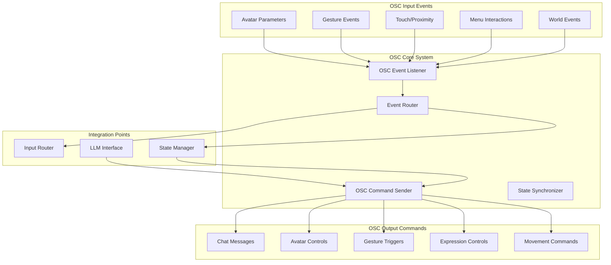

# OSC Interaction System Architecture

## OSC System Overview



## OSC Event Types & Addresses

### Input Events (VRChat → Bot)

#### Avatar State Events
```
/tracking/head              # Head position (x, y, z, w)
/tracking/controllers       # Controller positions
/avatar/parameters/*        # All avatar parameters
/avatar/change              # Avatar change event
```

#### Interaction Events
```
/avatar/parameters/Viseme   # Mouth movements for speech
/avatar/parameters/GestureLeft   # Left hand gestures (0-255)
/avatar/parameters/GestureRight  # Right hand gestures (0-255)
/avatar/parameters/VRCEmote      # Emote triggers
```

#### Touch & Proximity Events
```
/avatar/parameters/Touch*   # Various touch sensors
/avatar/parameters/Proximity*   # Proximity sensors
/avatar/parameters/Contact*     # Contact points
```

#### World & Social Events
```
/chatbox/typing            # Other users typing
/chatbox/input             # Chat messages (for monitoring)
/world/*                   # World-specific events
```

### Output Commands (Bot → VRChat)

#### Chat & Communication
```
/chatbox/input             # Send chat messages [message, immediate, notification]
/chatbox/typing            # Set typing state [isTyping]
```

#### Avatar Control
```
/input/MoveHorizontal      # Horizontal movement [-1.0 to 1.0]
/input/MoveVertical        # Vertical movement [-1.0 to 1.0]
/input/LookHorizontal      # Look left/right [-1.0 to 1.0]
/input/LookVertical        # Look up/down [-1.0 to 1.0]
```

#### Gesture & Expression Control
```
/avatar/parameters/GestureLeft   # Set left gesture (0-255)
/avatar/parameters/GestureRight  # Set right gesture (0-255)
/avatar/parameters/VRCEmote      # Trigger emotes
/avatar/parameters/*             # Set custom parameters
```

## Event Processing Pipeline

### 1. OSC Event Listener
```python
class OSCEventListener:
    def __init__(self, config, state_manager):
        self.server = AsyncOSCUDPServer()
        self.handlers = {}
        self.state_manager = state_manager
        
    def register_handler(self, address_pattern, handler):
        # Register callback for specific OSC addresses
        pass
        
    def start_listening(self, port=9001):
        # Start OSC server on specified port
        pass
        
    def parse_avatar_parameters(self, address, values):
        # Extract meaningful state from parameter updates
        pass
```

### 2. Event Classification
```python
@dataclass
class OSCEvent:
    address: str
    values: List[Any]
    timestamp: float
    event_type: EventType  # GESTURE, TOUCH, MOVEMENT, EXPRESSION
    priority: int
    requires_response: bool
```

### 3. Interaction Detection
- **Gesture Sequences**: Recognize patterns in gesture changes
- **Touch Patterns**: Detect meaningful touch interactions
- **Proximity Events**: Track when avatars get close
- **Expression Changes**: Monitor facial expression updates

## Avatar Interaction Types

### 1. Gesture-Based Interactions
```python
GESTURE_MAPPINGS = {
    "wave": [GesturePattern(hand="right", value=1, duration=2.0)],
    "point": [GesturePattern(hand="right", value=2, duration=1.5)],
    "fist": [GesturePattern(hand="left", value=3, duration=1.0)],
    "peace": [GesturePattern(hand="right", value=4, duration=2.0)],
    "rock": [GesturePattern(hand="left", value=5, duration=1.5)]
}
```

### 2. Touch & Proximity Interactions
```python
TOUCH_EVENTS = {
    "head_pat": TouchPattern(sensor="Head", duration=3.0),
    "hand_hold": TouchPattern(sensor="HandLeft", duration=5.0),
    "hug": MultiTouchPattern(sensors=["Chest", "Back"], simultaneous=True),
    "high_five": TouchPattern(sensor="HandRight", intensity=0.8)
}
```

### 3. Expression-Driven Interactions
```python
EXPRESSION_EVENTS = {
    "smile": ExpressionPattern(parameter="MouthSmile", threshold=0.7),
    "surprise": ExpressionPattern(parameter="BrowsUp", duration=2.0),
    "anger": ExpressionPattern(parameter="BrowsDown", intensity=0.8),
    "blink": ExpressionPattern(parameter="EyesClosed", rapid=True)
}
```

## Response System

### 1. Automatic Responses
```python
AUTOMATIC_RESPONSES = {
    "wave": "Hello there! Nice to see you.",
    "head_pat": "That feels nice, thank you!",
    "hug": "Aww, thanks for the hug!",
    "point": "Are you trying to show me something?"
}
```

### 2. Context-Aware Responses
- **Combine OSC + Speech**: "I see you're waving while saying hello"
- **World Context**: "In this quiet world, your gesture stands out"
- **Relationship Context**: "As a friend, I appreciate your interaction"

### 3. LLM-Enhanced Responses
- **Dynamic generation**: Create responses based on current conversation
- **Emotional context**: Match the emotional tone of interactions
- **Personalization**: Remember previous interactions with users

## State Management Integration

### Avatar State Tracking
```python
@dataclass
class AvatarState:
    position: Vector3
    rotation: Quaternion
    gestures: Dict[str, float]
    expressions: Dict[str, float]
    touch_sensors: Dict[str, bool]
    proximity_data: Dict[str, float]
    last_interaction: float
    interaction_history: List[Interaction]
```

### Interaction History
```python
@dataclass
class Interaction:
    type: InteractionType
    source: str  # user_id or "world"
    timestamp: float
    intensity: float
    duration: float
    response_given: bool
    emotional_impact: float
```

## Implementation Strategy

### Phase 1: Basic OSC Integration (Week 1)
- Implement OSC event listener for basic parameters
- Create OSC command sender for chat messages
- Set up basic gesture detection
- Integrate with existing state manager

### Phase 2: Advanced Interactions (Week 2)
- Implement touch and proximity event handling
- Create pattern recognition for gestures
- Add automatic response system
- Integrate with LLM for dynamic responses

### Phase 3: Context Fusion (Week 3)
- Combine OSC events with computer vision data
- Create multi-modal interaction understanding
- Implement relationship tracking
- Add emotional state modeling

## Technical Considerations

### Performance Optimization
- **Event filtering**: Only process relevant OSC messages
- **Debouncing**: Avoid rapid duplicate events
- **Batch processing**: Group related events
- **Priority queuing**: Handle high-priority interactions first

### Error Handling
- **Connection recovery**: Automatic OSC server restart
- **Message validation**: Verify OSC message formats
- **Fallback modes**: Continue with reduced functionality
- **Logging**: Detailed interaction logging for debugging

### Configuration
```yaml
osc:
  input_port: 9001
  output_port: 9000
  output_host: "127.0.0.1"
  enabled_events:
    - gestures
    - touch
    - expressions
  response_modes:
    automatic: true
    llm_enhanced: true
    context_aware: true
```

## Integration with Prompt Generator

### Context Enrichment
```python
def enrich_prompt_with_osc(osc_events, base_prompt):
    """Add OSC interaction context to prompts"""
    context = {
        "recent_gestures": get_recent_gestures(osc_events),
        "current_touch": get_active_touches(osc_events),
        "avatar_state": get_avatar_state(osc_events),
        "social_context": get_social_context(osc_events)
    }
    return base_prompt + f"\nCurrent physical context: {context}"
```

This OSC system will enable rich, responsive interactions that go beyond speech, making the AI bot feel more present and engaged in the VRChat world.