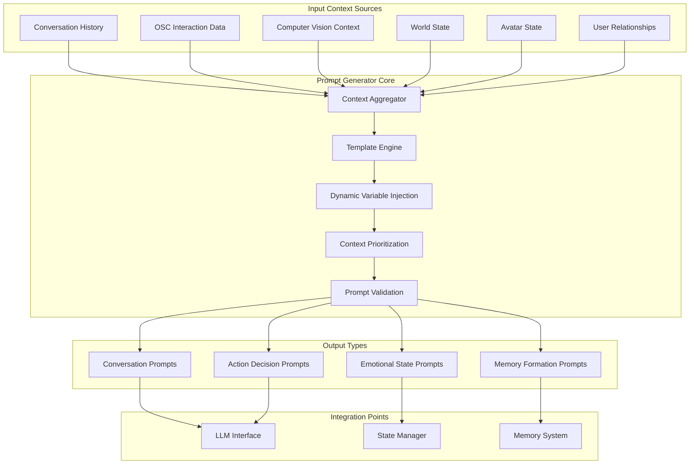

# Prompt Generator Architecture

## System Overview



## Core Prompt Generation System

### 1. Context Aggregation
```python
class ContextAggregator:
    def __init__(self, state_manager, config):
        self.state_manager = state_manager
        self.config = config
        
    def gather_current_context(self) -> Dict[str, Any]:
        """Collect all available context data"""
        return {
            "conversation": self.get_conversation_context(),
            "world": self.get_world_context(),
            "social": self.get_social_context(),
            "physical": self.get_physical_context(),
            "emotional": self.get_emotional_context(),
            "temporal": self.get_temporal_context()
        }
```

### 2. Template Engine
```python
class TemplateEngine:
    def __init__(self, template_dir: str):
        self.templates = self.load_templates(template_dir)
        
    def generate_prompt(self, 
                       template_name: str, 
                       context: Dict[str, Any],
                       prompt_type: PromptType) -> str:
        """Generate prompt using template and context"""
        template = self.get_template(template_name, prompt_type)
        return self.render_template(template, context)
```

## Context Types and Sources

### 1. Conversation Context
```python
@dataclass
class ConversationContext:
    recent_messages: List[Message]
    conversation_topic: str
    speaking_style: str
    emotional_tone: str
    user_preferences: Dict[str, Any]
    conversation_goals: List[str]
```

### 2. World Context (Computer Vision + OSC)
```python
@dataclass
class WorldContext:
    world_name: str
    world_type: str  # social, game, exploration, etc.
    player_count: int
    nearby_avatars: List[AvatarInfo]
    interactive_objects: List[ObjectInfo]
    current_location: str
    ambient_sounds: List[str]
    time_of_day: str
```

### 3. Social Context
```python
@dataclass
class SocialContext:
    friends_present: List[FriendInfo]
    strangers_present: List[AvatarInfo]
    group_dynamics: str  # "intimate", "crowded", "isolated"
    social_activity: str  # "dancing", "talking", "gaming"
    relationship_history: Dict[str, Relationship]
```

### 4. Physical Context (OSC Interactions)
```python
@dataclass
class PhysicalContext:
    recent_gestures: List[GestureEvent]
    active_touches: List[TouchEvent]
    avatar_expressions: Dict[str, float]
    proximity_events: List[ProximityEvent]
    movement_patterns: MovementPattern
```

## Prompt Templates

### 1. Conversation Prompt Template
```yaml
conversation_template: |
  You are {character_name}, a {character_description}.
  
  Current Context:
  - Location: {world_context.current_location} in {world_context.world_name}
  - People nearby: {social_context.friends_present_count} friends, {social_context.strangers_present_count} others
  - Recent interactions: {physical_context.recent_interactions_summary}
  
  Conversation Style:
  - Tone: {emotional_context.current_mood}
  - Speaking style: {conversation_context.speaking_style}
  - Current topic: {conversation_context.conversation_topic}
  
  Recent conversation:
  {conversation_context.recent_messages_formatted}
  
  User said: "{current_user_input}"
  
  Your response should be {response_characteristics}.
```

### 2. Action Decision Template
```yaml
action_template: |
  Analyze the current situation and decide on appropriate actions.
  
  Situation:
  - Physical context: {physical_context.summary}
  - Social context: {social_context.summary} 
  - Emotional state: {emotional_context.summary}
  
  Available actions:
  {available_actions_list}
  
  Considerations:
  - Your personality: {character_traits}
  - Current goals: {current_goals}
  - Social appropriateness: {social_norms}
  
  Choose the most appropriate action and explain why.
```

### 3. Memory Formation Template
```yaml
memory_template: |
  Create a memory entry for this significant interaction.
  
  Event details:
  - What happened: {event_description}
  - With whom: {participants}
  - Emotional impact: {emotional_impact}
  - Duration: {event_duration}
  
  Context:
  - Location: {world_context}
  - Time: {temporal_context}
  - Significance: {event_significance}
  
  Format as a concise memory that can be recalled later.
```

## Dynamic Variable Injection

### Context Variables
```python
CONTEXT_VARIABLES = {
    "{world_context.current_location}": lambda ctx: ctx.world.current_location,
    "{social_context.friends_present_count}": lambda ctx: len(ctx.social.friends_present),
    "{physical_context.recent_interactions_summary}": lambda ctx: format_interactions(ctx.physical.recent_gestures),
    "{emotional_context.current_mood}": lambda ctx: ctx.emotional.current_mood,
    "{conversation_context.recent_messages_formatted}": lambda ctx: format_messages(ctx.conversation.recent_messages),
    "{current_user_input}": lambda ctx: ctx.conversation.current_input
}
```

### Personality Variables
```python
PERSONALITY_VARIABLES = {
    "{character_name}": "Gerald",
    "{character_description}": "friendly AI companion in VRChat",
    "{character_traits}": "curious, helpful, slightly humorous",
    "{response_characteristics}": "natural, conversational, and context-appropriate"
}
```

## Context Prioritization

### Priority Weights
```python
PRIORITY_WEIGHTS = {
    "conversation_topic": 0.9,
    "recent_interaction": 0.8,
    "emotional_state": 0.7,
    "social_context": 0.6,
    "world_context": 0.5,
    "historical_patterns": 0.4
}
```

### Context Filtering
```python
def filter_relevant_context(self, full_context: Dict, current_focus: str) -> Dict:
    """Filter context to most relevant elements based on current focus"""
    relevance_scores = self.calculate_relevance_scores(full_context, current_focus)
    return {
        key: value for key, value in full_context.items() 
        if relevance_scores[key] > self.config.relevance_threshold
    }
```

## Integration with LLM System

### Prompt Chaining
```python
class PromptChain:
    def __init__(self, prompt_generator, llm_interface):
        self.prompt_generator = prompt_generator
        self.llm_interface = llm_interface
        
    def generate_conversation_chain(self, user_input: str) -> List[Dict]:
        """Generate a chain of prompts for complex conversations"""
        context = self.prompt_generator.gather_current_context()
        
        # Step 1: Analyze intent and emotional context
        analysis_prompt = self.prompt_generator.generate_prompt(
            "intent_analysis", context, PromptType.ANALYSIS
        )
        analysis_result = self.llm_interface.generate_response(analysis_prompt)
        
        # Step 2: Generate emotional response
        emotional_prompt = self.prompt_generator.generate_prompt(
            "emotional_response", 
            {**context, "analysis": analysis_result},
            PromptType.EMOTIONAL
        )
        
        # Step 3: Generate final conversation response
        conversation_prompt = self.prompt_generator.generate_prompt(
            "conversation",
            {**context, "emotional_context": emotional_prompt},
            PromptType.CONVERSATION
        )
        
        return conversation_prompt
```

## Configuration System

### Prompt Configuration
```yaml
prompt_generator:
  templates_dir: "./prompt_templates"
  max_context_length: 4000
  relevance_threshold: 0.3
  context_ttl: 300  # seconds
  
  personality:
    name: "Gerald"
    description: "friendly AI companion"
    traits: ["curious", "helpful", "adaptable"]
    speaking_style: "conversational"
    
  context_weights:
    conversation: 0.9
    interactions: 0.8
    world: 0.6
    social: 0.7
    
  templates:
    conversation: "conversation_template.yaml"
    action: "action_template.yaml" 
    memory: "memory_template.yaml"
    analysis: "analysis_template.yaml"
```

## Implementation Strategy

### Phase 1: Basic Prompt Generation (Week 1)
- Implement core template engine
- Create basic conversation templates
- Integrate with existing conversation history
- Add simple context variables

### Phase 2: Enhanced Context (Week 2)
- Integrate OSC interaction data
- Add world context from basic CV
- Implement context prioritization
- Create action decision prompts

### Phase 3: Advanced Features (Week 3)
- Add emotional context modeling
- Implement prompt chaining
- Create memory formation prompts
- Add dynamic personality adaptation

### Phase 4: Optimization (Week 4)
- Context caching and TTL management
- Performance optimization
- Template validation and testing
- User customization system

## Error Handling and Validation

### Prompt Validation
```python
class PromptValidator:
    def validate_prompt(self, prompt: str, context: Dict) -> ValidationResult:
        """Validate generated prompt for safety and quality"""
        checks = [
            self.check_length(prompt),
            self.check_safety(prompt, context),
            self.check_relevance(prompt, context),
            self.check_coherence(prompt)
        ]
        return all(checks)
    
    def check_safety(self, prompt: str, context: Dict) -> bool:
        """Ensure prompt doesn't contain unsafe content"""
        # Implement content safety checks
        return True
```

This prompt generator architecture will enable your AI bot to create rich, context-aware responses that incorporate all available data sources, making interactions more natural and engaging.