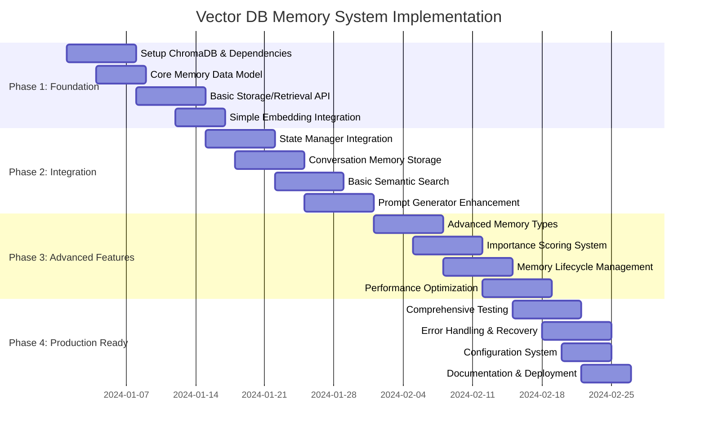

# Vector DB Memory System - Implementation Roadmap

## Overview

This roadmap provides a step-by-step implementation plan for integrating vector database memory storage into the VRChat AI bot. The plan is designed for beginners while building toward advanced capabilities.

## Implementation Timeline



## Phase 1: Foundation (Weeks 1-2)

### Week 1: Setup and Core Infrastructure

**Objective**: Establish basic vector DB infrastructure and core memory classes

**Files to Create:**
- `src/memory/memory_models.py` - Core memory data classes
- `src/memory/chroma_db_config.py` - ChromaDB configuration
- `src/memory/basic_memory_manager.py` - Core storage/retrieval
- `requirements_memory.txt` - Dependencies

**Implementation Steps:**
1. **Install Dependencies**
   ```bash
   pip install chromadb sentence-transformers
   ```

2. **Create Core Memory Classes**
   - Implement `Memory`, `ConversationMemory`, `InteractionMemory` base classes
   - Add serialization/deserialization methods
   - Create memory type enumeration

3. **Setup ChromaDB**
   - Configure local persistence
   - Create memory collection
   - Test basic CRUD operations

4. **Basic Embedding Integration**
   - Integrate sentence-transformers
   - Test embedding generation
   - Validate embedding consistency

**Success Criteria:**
- ✅ ChromaDB running locally with persistence
- ✅ Memory objects can be created and stored
- ✅ Basic embedding generation working
- ✅ Simple memory retrieval functional

### Week 2: Core API Development

**Objective**: Build robust memory storage and retrieval API

**Files to Create:**
- `src/memory/memory_manager.py` - Complete memory management
- `src/memory/embedding_strategy.py` - Embedding generation
- `tests/test_memory_basic.py` - Basic unit tests

**Implementation Steps:**
1. **Complete MemoryManager Class**
   - Add memory storage with embeddings
   - Implement semantic search
   - Add metadata filtering
   - Create memory reconstruction

2. **Embedding Strategy**
   - Implement different embedding approaches
   - Add embedding caching
   - Handle embedding failures gracefully

3. **Basic Testing**
   - Unit tests for memory creation
   - Integration tests for storage/retrieval
   - Performance baseline tests

**Success Criteria:**
- ✅ Full memory lifecycle (create, store, retrieve, delete)
- ✅ Semantic search working with similarity scores
- ✅ Metadata filtering functional
- ✅ Basic test coverage > 80%

## Phase 2: Integration (Weeks 3-4)

### Week 3: State Manager Integration

**Objective**: Integrate memory system with existing State Manager

**Files to Create:**
- `src/memory/enhanced_state_manager.py` - Memory-enhanced state management
- `src/integration/memory_integration.py` - Integration helpers
- `tests/test_state_integration.py` - Integration tests

**Implementation Steps:**
1. **Enhanced State Manager**
   - Extend existing StateManager class
   - Add automatic conversation memory creation
   - Integrate memory retrieval into state context

2. **Conversation Memory Automation**
   - Auto-create memories from user interactions
   - Extract emotional tone and topics
   - Calculate response quality scores

3. **Integration Testing**
   - Test memory creation during conversations
   - Validate state consistency
   - Performance impact assessment

**Success Criteria:**
- ✅ Automatic conversation memory creation
- ✅ State Manager uses memory context
- ✅ No performance degradation in main loop
- ✅ Integration tests passing

### Week 4: Prompt Generator Enhancement

**Objective**: Enhance prompts with relevant memories

**Files to Create:**
- `src/memory/memory_enhanced_prompt_generator.py`
- `src/templates/memory_context.yaml` - Memory context templates
- `tests/test_prompt_enhancement.py`

**Implementation Steps:**
1. **Memory-Enhanced Prompt Generator**
   - Extend existing PromptGenerator
   - Add memory retrieval to context gathering
   - Format memories for LLM consumption

2. **Context-Aware Memory Retrieval**
   - Semantic search based on current conversation
   - Temporal filtering for recent memories
   - Importance-weighted memory selection

3. **Prompt Template Enhancement**
   - Add memory context section to templates
   - Create memory formatting utilities
   - Test memory integration in various prompt types

**Success Criteria:**
- ✅ Prompts include relevant past memories
- ✅ Memory context improves response quality
- ✅ Configurable memory context length
- ✅ No significant latency increase

## Phase 3: Advanced Features (Weeks 5-6)

### Week 5: Advanced Memory Types

**Objective**: Implement specialized memory types and embedding strategies

**Files to Create:**
- `src/memory/specialized_memories.py` - Advanced memory types
- `src/memory/advanced_embedding.py` - Multi-modal embeddings
- `src/memory/memory_importance.py` - Importance scoring

**Implementation Steps:**
1. **Specialized Memory Types**
   - EmotionalMemory with intensity tracking
   - InteractionMemory for OSC events
   - WorldEventMemory for environment changes
   - UserRelationshipMemory for social context

2. **Advanced Embedding Strategies**
   - Type-specific embedding generation
   - Multi-modal embeddings (text + metadata)
   - Hybrid search capabilities

3. **Importance Scoring System**
   - Calculate memory importance scores
   - Factor-based scoring (emotional intensity, duration, etc.)
   - Adaptive importance based on usage patterns

**Success Criteria:**
- ✅ All memory types implemented and tested
- ✅ Advanced embedding improves search relevance
- ✅ Importance scoring correlates with memory usefulness
- ✅ Memory system handles 10K+ memories efficiently

### Week 6: Memory Lifecycle and Optimization

**Objective**: Implement memory maintenance and performance optimization

**Files to Create:**
- `src/memory/memory_lifecycle.py` - Lifecycle management
- `src/memory/memory_maintenance.py` - Maintenance utilities
- `src/utils/memory_optimization.py` - Performance optimization

**Implementation Steps:**
1. **Memory Lifecycle Management**
   - Implement memory pruning based on importance
   - Add memory compression for old memories
   - Create backup and restore functionality

2. **Performance Optimization**
   - Implement embedding caching
   - Add batch operations for memory storage
   - Optimize search queries
   - Memory usage monitoring

3. **Maintenance Utilities**
   - Scheduled memory cleanup
   - Database health checks
   - Memory statistics and reporting

**Success Criteria:**
- ✅ Automatic memory pruning working
- ✅ Performance optimized for real-time use
- ✅ Memory usage stays within limits
- ✅ Comprehensive monitoring in place

## Phase 4: Production Ready (Weeks 7-8)

### Week 7: Testing and Error Handling

**Objective**: Comprehensive testing and robust error handling

**Files to Create:**
- `tests/integration/test_memory_system.py` - Full system tests
- `src/memory/error_handling.py` - Error handling utilities
- `src/memory/recovery_strategies.py` - Recovery mechanisms

**Implementation Steps:**
1. **Comprehensive Testing**
   - Unit tests for all memory components
   - Integration tests with full system
   - Performance and load testing
   - Edge case and failure testing

2. **Error Handling**
   - Graceful handling of embedding failures
   - Database connection recovery
   - Memory corruption detection and repair
   - Fallback strategies for critical failures

3. **Recovery Mechanisms**
   - Automatic backup and restore
   - Data consistency checks
   - Progressive degradation under load
   - Health monitoring and alerts

**Success Criteria:**
- ✅ Test coverage > 90%
- ✅ All error conditions handled gracefully
- ✅ System recovers from failures automatically
- ✅ Performance under load meets requirements

### Week 8: Configuration and Deployment

**Objective**: Final configuration system and deployment preparation

**Files to Create:**
- `config/memory_config.yaml` - Memory system configuration
- `docs/memory_system_guide.md` - User documentation
- `scripts/deploy_memory_system.py` - Deployment scripts

**Implementation Steps:**
1. **Configuration System**
   - Comprehensive YAML configuration
   - Environment-specific settings
   - Runtime configuration updates
   - Configuration validation

2. **Documentation**
   - User guide for memory system
   - Configuration reference
   - Troubleshooting guide
   - API documentation

3. **Deployment Preparation**
   - Deployment scripts and automation
   - Environment setup documentation
   - Performance tuning guide
   - Monitoring and logging setup

**Success Criteria:**
- ✅ Complete configuration system
- ✅ Comprehensive user documentation
- ✅ Easy deployment process
- ✅ Production-ready memory system

## Critical Dependencies

### Blocking Dependencies
1. **ChromaDB Setup** → All memory operations
2. **Embedding Model** → Semantic search functionality  
3. **State Manager** → Memory creation integration
4. **Configuration System** → All components

### Parallel Dependencies
1. **Prompt Generator** → Can be enhanced after basic integration
2. **Advanced Memory Types** → Can be added incrementally
3. **Performance Optimization** → Can be improved over time

## Risk Mitigation

### High Risk Areas
1. **Performance Impact**
   - **Risk**: Memory operations slow down main loop
   - **Mitigation**: Async operations, caching, batch processing
   - **Fallback**: Disable memory features if performance unacceptable

2. **Embedding Quality**
   - **Risk**: Poor semantic search results
   - **Mitigation**: Multiple embedding models, hybrid search
   - **Fallback**: Keyword-based fallback search

3. **Database Corruption**
   - **Risk**: Memory data loss or corruption
   - **Mitigation**: Regular backups, data validation, repair tools
   - **Fallback**: Rebuild from conversation logs

### Contingency Plans
- **Phase 2 Delay**: Focus on basic memory storage without advanced features
- **Performance Issues**: Implement progressive enhancement with configurable limits
- **Integration Problems**: Provide fallback to memory-less operation

## Success Metrics

### Technical Metrics
- **Response Time**: < 100ms for memory retrieval
- **Memory Accuracy**: > 80% relevant memories retrieved
- **Storage Efficiency**: < 1GB for 10,000 memories
- **Uptime**: > 99% memory system availability

### User Experience Metrics
- **Response Quality**: Improved context awareness in conversations
- **Memory Recall**: Accurate reference to past interactions
- **System Stability**: No performance degradation
- **Feature Adoption**: > 80% use of memory-enhanced features

## Resource Requirements

### Development Dependencies
```txt
chromadb>=0.4.0
sentence-transformers>=2.2.0
numpy>=1.21.0
```

### Hardware Requirements
- **Minimum**: 2GB additional RAM, 1GB storage
- **Recommended**: 4GB additional RAM, 2GB storage  
- **Optimal**: 8GB additional RAM, 5GB storage

## Next Steps

1. **Review this roadmap** and adjust timeline as needed
2. **Begin Phase 1 implementation** following weekly breakdown
3. **Regular progress reviews** to track implementation
4. **User testing** at each milestone for feedback
5. **Performance monitoring** throughout implementation

This roadmap provides a clear, incremental path to implementing a robust vector DB memory system that starts simple but scales to advanced capabilities.