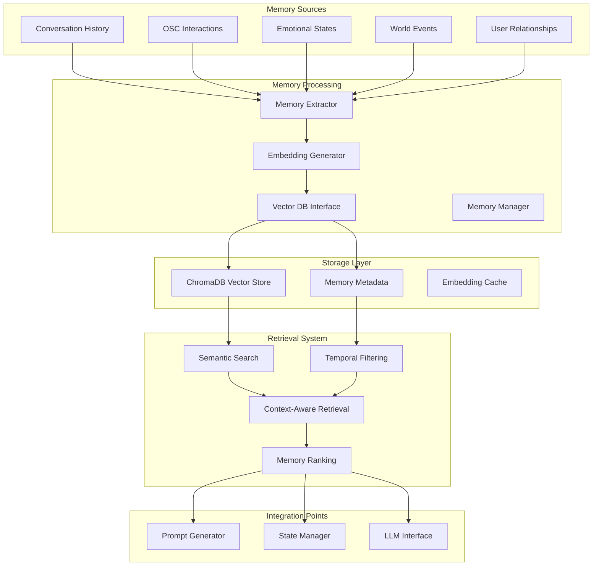

# Vector DB Memory System for AI Bot

## Overview

This plan outlines a vector database storage system for the VRChat AI bot's memory, enabling semantic search and long-term context retention. The system is designed to be beginner-friendly while providing a solid foundation for advanced features.

## System Architecture



## Memory Data Model

### Core Memory Types

```python
from dataclasses import dataclass
from datetime import datetime
from typing import List, Dict, Any, Optional
from enum import Enum

class MemoryType(Enum):
    CONVERSATION = "conversation"
    INTERACTION = "interaction"
    EMOTIONAL = "emotional"
    WORLD_EVENT = "world_event"
    USER_RELATIONSHIP = "user_relationship"

@dataclass
class Memory:
    id: str
    type: MemoryType
    content: str
    embedding: Optional[List[float]] = None
    metadata: Dict[str, Any]
    timestamp: datetime
    importance_score: float
    user_id: Optional[str] = None
    world_id: Optional[str] = None
    
    # Computed fields
    def get_search_text(self) -> str:
        """Text used for semantic search"""
        return f"{self.content} {self.metadata.get('summary', '')}"
    
    def get_metadata_filter(self) -> Dict[str, Any]:
        """Metadata used for filtering"""
        return {
            "type": self.type.value,
            "user_id": self.user_id,
            "world_id": self.world_id,
            "timestamp": self.timestamp.isoformat()
        }
```

### Specific Memory Types

```python
@dataclass
class ConversationMemory(Memory):
    speaker: str
    emotional_tone: str
    conversation_topic: str
    response_quality: float
    
    def __post_init__(self):
        self.type = MemoryType.CONVERSATION
        self.metadata.update({
            "speaker": self.speaker,
            "emotional_tone": self.emotional_tone,
            "conversation_topic": self.conversation_topic,
            "response_quality": self.response_quality
        })

@dataclass
class InteractionMemory(Memory):
    interaction_type: str  # "touch", "gesture", "proximity"
    target_user: Optional[str]
    intensity: float
    duration: float
    
    def __post_init__(self):
        self.type = MemoryType.INTERACTION
        self.metadata.update({
            "interaction_type": self.interaction_type,
            "target_user": self.target_user,
            "intensity": self.intensity,
            "duration": self.duration
        })

@dataclass
class EmotionalMemory(Memory):
    emotion_type: str  # "happy", "sad", "excited", etc.
    intensity: float
    trigger: str
    duration: float
    
    def __post_init__(self):
        self.type = MemoryType.EMOTIONAL
        self.metadata.update({
            "emotion_type": self.emotion_type,
            "intensity": self.intensity,
            "trigger": self.trigger,
            "duration": self.duration
        })
```

## Technology Selection: ChromaDB

**Why ChromaDB for Beginners:**
- ✅ **Simple Setup**: Single Python package, no external dependencies
- ✅ **Local First**: Runs entirely locally, no cloud dependencies
- ✅ **Python Native**: Excellent Python API with minimal boilerplate
- ✅ **Embedding Support**: Built-in embedding functions or bring your own
- ✅ **Metadata Filtering**: Powerful querying capabilities
- ✅ **Persistence**: Automatic data persistence
- ✅ **Active Development**: Well-maintained and documented

### ChromaDB Configuration

```python
import chromadb
from chromadb.config import Settings

class ChromaDBConfig:
    def __init__(self, persist_directory: str = "./memory_db"):
        self.persist_directory = persist_directory
        self.settings = Settings(
            chroma_db_impl="duckdb+parquet",
            persist_directory=persist_directory,
            anonymized_telemetry=False
        )
        
    def get_client(self):
        return chromadb.Client(self.settings)
```

## Memory Storage and Retrieval API

### Core Memory Manager

```python
class MemoryManager:
    def __init__(self, config: ConfigurationManager):
        self.config = config
        self.db_config = ChromaDBConfig()
        self.client = self.db_config.get_client()
        self.collection = self._initialize_collection()
        self.embedding_model = self._initialize_embedding_model()
    
    def _initialize_collection(self):
        """Initialize or load the memory collection"""
        try:
            return self.client.get_collection("ai_memories")
        except:
            return self.client.create_collection(
                name="ai_memories",
                metadata={"description": "AI Bot Long-term Memory"}
            )
    
    def _initialize_embedding_model(self):
        """Initialize embedding model (start with sentence-transformers)"""
        try:
            from sentence_transformers import SentenceTransformer
            return SentenceTransformer('all-MiniLM-L6-v2')
        except ImportError:
            # Fallback to Chroma's default embedding
            return None
    
    def store_memory(self, memory: Memory) -> str:
        """Store a memory with embedding"""
        # Generate embedding if not provided
        if memory.embedding is None:
            memory.embedding = self._generate_embedding(memory.get_search_text())
        
        # Store in vector DB
        self.collection.add(
            embeddings=[memory.embedding],
            documents=[memory.content],
            metadatas=[memory.get_metadata_filter()],
            ids=[memory.id]
        )
        
        return memory.id
    
    def _generate_embedding(self, text: str) -> List[float]:
        """Generate embedding for text"""
        if self.embedding_model:
            return self.embedding_model.encode(text).tolist()
        else:
            # Use Chroma's default embedding
            return self.collection._embedding_function([text])[0]
    
    def search_memories(self, 
                       query: str, 
                       filters: Optional[Dict] = None,
                       limit: int = 5) -> List[Memory]:
        """Search memories by semantic similarity"""
        # Generate query embedding
        query_embedding = self._generate_embedding(query)
        
        # Perform search
        results = self.collection.query(
            query_embeddings=[query_embedding],
            n_results=limit,
            where=filters,
            include=["metadatas", "documents", "distances"]
        )
        
        return self._format_search_results(results)
    
    def _format_search_results(self, results) -> List[Memory]:
        """Convert ChromaDB results to Memory objects"""
        memories = []
        for i in range(len(results['ids'][0])):
            memory_data = {
                'id': results['ids'][0][i],
                'content': results['documents'][0][i],
                'metadata': results['metadatas'][0][i],
                'similarity_score': 1 - results['distances'][0][i]  # Convert distance to similarity
            }
            memories.append(self._reconstruct_memory(memory_data))
        
        return memories
    
    def get_recent_memories(self, 
                           memory_type: Optional[MemoryType] = None,
                           hours: int = 24,
                           limit: int = 10) -> List[Memory]:
        """Get recent memories with optional type filtering"""
        import datetime
        cutoff_time = datetime.datetime.now() - datetime.timedelta(hours=hours)
        
        filters = {"timestamp": {"$gte": cutoff_time.isoformat()}}
        if memory_type:
            filters["type"] = memory_type.value
        
        # ChromaDB doesn't support complex temporal queries natively,
        # so we'll implement this with post-filtering
        all_results = self.collection.get(where=filters)
        return self._sort_by_timestamp(all_results, limit)
```

## Embedding Strategy

### Multi-Modal Embedding Approach

```python
class EmbeddingStrategy:
    def __init__(self, memory_manager: MemoryManager):
        self.memory_manager = memory_manager
    
    def generate_conversation_embedding(self, memory: ConversationMemory) -> List[float]:
        """Enhanced embedding for conversation memories"""
        embedding_text = f"""
        Conversation: {memory.content}
        Speaker: {memory.speaker}
        Emotional Tone: {memory.emotional_tone}
        Topic: {memory.conversation_topic}
        Quality: {memory.response_quality}
        """
        return self.memory_manager._generate_embedding(embedding_text)
    
    def generate_interaction_embedding(self, memory: InteractionMemory) -> List[float]:
        """Enhanced embedding for interaction memories"""
        embedding_text = f"""
        Interaction: {memory.interaction_type}
        Target: {memory.target_user}
        Intensity: {memory.intensity}
        Duration: {memory.duration}
        Context: {memory.content}
        """
        return self.memory_manager._generate_embedding(embedding_text)
    
    def generate_hybrid_embedding(self, memory: Memory) -> List[float]:
        """Generate embedding based on memory type"""
        if isinstance(memory, ConversationMemory):
            return self.generate_conversation_embedding(memory)
        elif isinstance(memory, InteractionMemory):
            return self.generate_interaction_embedding(memory)
        else:
            return self.memory_manager._generate_embedding(memory.get_search_text())
```

## Memory Lifecycle Management

### Creation and Importance Scoring

```python
class MemoryLifecycleManager:
    def __init__(self, memory_manager: MemoryManager):
        self.memory_manager = memory_manager
        self.importance_calculator = ImportanceCalculator()
    
    def create_memory(self, raw_data: Dict[str, Any]) -> Memory:
        """Create and score a new memory"""
        memory = self._create_memory_from_data(raw_data)
        memory.importance_score = self.importance_calculator.calculate_importance(memory)
        return self.memory_manager.store_memory(memory)
    
    def _create_memory_from_data(self, data: Dict) -> Memory:
        """Create appropriate memory type from raw data"""
        memory_type = MemoryType(data.get('type', 'conversation'))
        
        if memory_type == MemoryType.CONVERSATION:
            return ConversationMemory(**data)
        elif memory_type == MemoryType.INTERACTION:
            return InteractionMemory(**data)
        elif memory_type == MemoryType.EMOTIONAL:
            return EmotionalMemory(**data)
        else:
            return Memory(**data)

class ImportanceCalculator:
    def calculate_importance(self, memory: Memory) -> float:
        """Calculate importance score for memory retention"""
        base_score = 0.5
        
        # Conversation importance factors
        if isinstance(memory, ConversationMemory):
            base_score += memory.response_quality * 0.3
            if memory.emotional_tone in ['excited', 'angry', 'sad']:
                base_score += 0.2
        
        # Interaction importance factors
        elif isinstance(memory, InteractionMemory):
            base_score += memory.intensity * 0.4
            base_score += (memory.duration / 60) * 0.1  # Longer interactions more important
        
        # Emotional memory importance
        elif isinstance(memory, EmotionalMemory):
            base_score += memory.intensity * 0.5
        
        return min(1.0, base_score)  # Cap at 1.0
```

### Memory Pruning and Maintenance

```python
class MemoryMaintenance:
    def __init__(self, memory_manager: MemoryManager):
        self.memory_manager = memory_manager
    
    def prune_low_importance_memories(self, threshold: float = 0.2):
        """Remove memories below importance threshold"""
        low_importance_memories = self.memory_manager.search_memories(
            query="",  # Empty query to get all
            filters={"importance_score": {"$lt": threshold}},
            limit=1000  # Large limit to get all low-importance memories
        )
        
        for memory in low_importance_memories:
            self.memory_manager.delete_memory(memory.id)
    
    def compact_memories(self, max_memories: int = 10000):
        """Keep only the most important memories if over limit"""
        all_memories = self.memory_manager.get_all_memories()
        if len(all_memories) > max_memories:
            # Sort by importance and keep top N
            sorted_memories = sorted(all_memories, 
                                   key=lambda m: m.importance_score, 
                                   reverse=True)
            memories_to_keep = sorted_memories[:max_memories]
            memories_to_remove = sorted_memories[max_memories:]
            
            for memory in memories_to_remove:
                self.memory_manager.delete_memory(memory.id)
```

## Integration with Existing Architecture

### Integration with State Manager

```python
class EnhancedStateManager(StateManager):
    def __init__(self, config: ConfigurationManager, memory_manager: MemoryManager):
        super().__init__(config)
        self.memory_manager = memory_manager
    
    def update_conversation_state(self, user_input: str, ai_response: str):
        """Enhanced to also store in long-term memory"""
        super().update_conversation_state(user_input, ai_response)
        
        # Create conversation memory
        conversation_memory = ConversationMemory(
            id=f"conv_{int(time.time())}",
            content=f"User: {user_input}\nAI: {ai_response}",
            speaker="user+ai",
            emotional_tone=self._detect_emotional_tone(user_input),
            conversation_topic=self._extract_topic(user_input),
            response_quality=self._rate_response_quality(ai_response, user_input),
            metadata={},
            timestamp=datetime.now(),
            importance_score=0.0,  # Will be calculated
            user_id=self.get_current_user()
        )
        
        self.memory_manager.store_memory(conversation_memory)
```

### Integration with Prompt Generator

```python
class MemoryEnhancedPromptGenerator(PromptGenerator):
    def __init__(self, config: ConfigurationManager, 
                 state_manager: StateManager,
                 memory_manager: MemoryManager):
        super().__init__(config, state_manager)
        self.memory_manager = memory_manager
    
    def generate_context_prompt(self, user_input: str, context: Dict) -> List[Dict]:
        """Enhanced with relevant memories"""
        base_prompt = super().generate_context_prompt(user_input, context)
        
        # Add relevant memories to context
        relevant_memories = self._get_relevant_memories(user_input, context)
        memory_context = self._format_memories_for_prompt(relevant_memories)
        
        # Insert memory context into system prompt
        system_message = base_prompt[0]
        system_message['content'] += f"\n\nRelevant Past Experiences:\n{memory_context}"
        
        return base_prompt
    
    def _get_relevant_memories(self, user_input: str, context: Dict) -> List[Memory]:
        """Get memories relevant to current context"""
        # Semantic search based on user input
        semantic_memories = self.memory_manager.search_memories(
            query=user_input,
            limit=3
        )
        
        # Temporal memories (recent interactions)
        recent_memories = self.memory_manager.get_recent_memories(
            hours=24,
            limit=2
        )
        
        return semantic_memories + recent_memories
```

## Implementation Phases

### Phase 1: Foundation (Week 1-2)
- **Setup ChromaDB** and basic memory storage
- **Implement core Memory classes** and data model
- **Create basic embedding** with sentence-transformers
- **Simple memory storage/retrieval** API
- **Integration with State Manager** for conversation history

### Phase 2: Enhanced Features (Week 3-4)
- **Advanced embedding strategies** for different memory types
- **Importance scoring** and memory lifecycle
- **Semantic search** with metadata filtering
- **Integration with Prompt Generator** for context enhancement
- **Basic memory pruning** and maintenance

### Phase 3: Advanced Capabilities (Week 5-6)
- **Multi-modal embeddings** (text + metadata)
- **Advanced retrieval** (hybrid search, temporal reasoning)
- **Memory compression** and summarization
- **Performance optimization** and caching
- **Comprehensive testing** and validation

## Configuration

### Memory System Configuration

```yaml
memory_system:
  vector_db:
    type: "chromadb"
    persist_directory: "./memory_db"
    collection_name: "ai_memories"
  
  embedding:
    model: "all-MiniLM-L6-v2"
    cache_embeddings: true
    batch_size: 32
  
  retrieval:
    default_limit: 5
    similarity_threshold: 0.7
    max_context_length: 2000
  
  lifecycle:
    importance_threshold: 0.2
    max_memories: 10000
    prune_interval_hours: 24
    backup_interval_hours: 6
```

## Testing Strategy

### Unit Tests
- Memory creation and serialization
- Embedding generation consistency
- Basic CRUD operations
- Importance scoring accuracy

### Integration Tests
- End-to-end memory